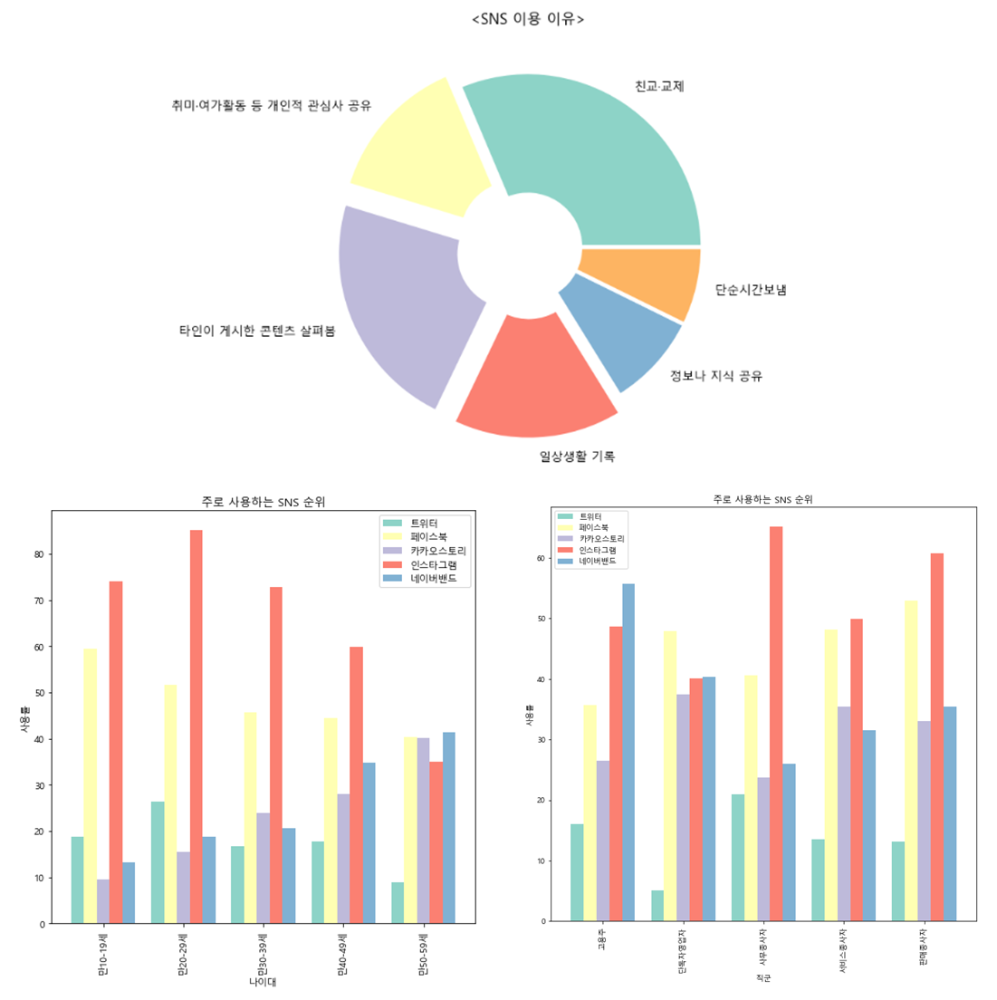

# Readme

- 소속 : 에이콘 아카데미 빅데이터 분석과정
- 팀명 : finale
- 팀원 : 남수민, 박명훈, 박주현, 임성길, 이소민, 전대한
- 사용 라이브러리
    - Python, Selenium, BeautifulSoup, TensorFlow, SckitLearn, pandas, matplotlib, R
- 주제 : 양질의 컨텐츠 구성을 위한 적절한 해시태그 제안
    - 이미지 분류를 위한 CNN 모델 을 기반으로

---

# 1. 서론

## (1) 주제

- 인스타그램을 선정한 이유
    
    
    
    1. 현재 우리나라에서 가장 많이 사용되는 SNS이며 현재에도 다운로드 횟수가 계속 증가하는 추세를 보임
    2. 다양한 연령의 사람들이 사용하며 나이대별, 직업별 분류에서 가장 많이 사용하는 SNS임을 확인
- 외식 메뉴를 선정한 이유
    - SNS에서 진행하는 다양한 유형의 광고를 비교 해봤을 때 식음료/식품 업종에서 특히 인스타그램 광고를 선호하는 경향을 확인
- Target
    - **마이크로 인플루언서**를 프로젝트의 주 타겟으로 선정
    - 마이크로 인플루언서는 인플루언서 중에서 약 500~10만명 이내의 팔로워를 보유한 사람들을 지칭한다.
    - SNS의 광고는 인플루언서와 팔로워의 상호작용성에 따라 광고효과의 차이를 보임. 따라서 최근 팔로워들과 비교적 즉각적인 소통이 가능하고 긴밀한 관계를 유지하여 ‘광고’에서 오는 부정적인 효과를 상쇄할 수 있는 마이크로 인플루언서를 주체로 한 마케팅을 주 목적으로 현 프로젝트를 진행

## (2) 진행 과정

1. 이미지 데이터
    - kaggle, naver, google 에서 카테고리(음식)별 약 3500~4800장, 총 28,080개의 이미지 데이터를 웹 크롤링을 통해 직접 수집
    - 수집한 훈련용 이미지 데이터를 학습시켜 96.72%의 정확도를 가진 CNN 모델 설계
    - 새로운 이미지로 예측했을 때 98% 이상의 정확도로 분류 성공
2. 텍스트 데이터
    - 웹 크롤링을 통해 인스타그램에서 두 단계로 데이터 수집
        - 1차 : 인스타그램 아이디, 게시글 본문, 해시태그, 좋아요 수 수집
        - 2차 : 1차에서 수집한 아이디를 통해 각 계정에 접속해 팔로워 수와 게시글 수 추가 수집
    - 총 12개의 변수, 13,330개의 데이터를 가진 최종 데이터 셋을 완성

| 변수명 |  | 전처리 방향 | 비고 |
| --- | --- | --- | --- |
| Category | 음식 이름 | 컬럼 추가 |  |
| ID | 인스타그램 계정 | Category로 1차 크롤링 |  |
| Post_num | 게시글 수 | ID로 2차 크롤링 |  |
| Followers | 팔로워 수 | ID로 2차 크롤링 |  |
| Contents | 게시글 본문 | Category로 1차 크롤링 | 정규표현식으로 특수문자 삭제 |
| Tags | 게시글 해시태그 | Category로 1차 크롤링 | 정규표현식으로 #을 기준으로 추출 |
| Tags_sum | Tags의 수 | 컬럼 추가 |  |
| Tags_count | 빈도수 태그와 중복 수 | 컬럼 추가 |  |
| Tags_rate | 태그 중복 비율 | 컬럼 추가 | (Tag_count/Tags_sum) * 100 |
| Likes | 좋아요 수 | Category로 1차 크롤링 | '가장 먼저 좋아요를 눌러보세요’ → 0 |
|  |  |  | 'oo님이 좋아합니다’ → 1 |
|  |  |  | ’여러명이 좋아합니다’ → 중간값 대체 |
| Scaled_likes | Likes 정규화 | 컬럼 추가 |  |
| Contents_len | Contents의 글자 수 | 컬럼 추가 |  |

# 2. 본론

## (1) 트렌드 분석

### (1-1) 2022 음식 트렌드 현황 분석

- 음식별 좋아요 수를 기준으로 상위 300개 추출했을 때 치킨, 스시, 돈까스 카테고리에서 사용된 해시태그의 수가 가장 많음
- 치킨 : #저녁, #야식, #떡볶이, #맥주, #소주, #라면
- 스시 : #점심, #저녁, #사시미, #우동, #사케, #라멘
- 돈까스 : #점심, #저녁, #떡볶이, #우동, #쫄면, #새우튀김

### (1-2) 2023 음식트렌드 전망

| 치킨 | 떡볶이 혹은 라면(볶음면) 등과 함께 다양한 조합으로 소비될 것 |
| --- | --- |
| 스시 | SNS 인증 특성을 고려한다면 이러한 고급화 추세가 더욱 가속화될 것 |
| 돈까스 | 경양식은 추억의 맛, 일식은 정통성을 강조하며, 혼밥, 점심 메뉴로 소비될 것 |
| 떡볶이 | 페어링 가능성이 높은 만큼 다양한 음식과의 콜라보레이션이 늘어날 것 |
| 햄버거 | ‘수제’를 강조하고 있는 만큼 수제햄버거의 종류와 질 모두 증가할 것으로 예상 |
| 파스타 | 파스타계의 변화로는 ‘생면’이 떠오르고 있음 |
| 피자 | 식당을 언급하는 해시태그도 많았지만 배달음식으로 소비되는 경향이 여전히 계속될 것 |

## (2) 음식별 분석(치킨)

- 태그 현황 분석
    - 치킨 카데고리 분석 : 배달앱 결제 건수 약 5,560만건 중 21.1%로 가장 자주 시켜 먹는 메뉴

| 치킨 관련 해시태그 | #먹스타그램, #맛집, #맛스타그램, #치킨맛집, #일상, #먹방, #좋아요, #치맥, #맛팔, #먹스타 |
| --- | --- |
| 전체 음식 해시태그 | #먹스타그램, #맛집, #일상, #맛스타그램, #초밥, #소통, #먹방, #맞팔, #좋아요, #먹스타 |

**⇒ 음식의 고유성과는 별개로 음식과 관련된 #먹스타그램, #맛집 과 같은 필수 해시태그 필요!**

## (3) 게시글 유형 분석

### (3-1) 워드 클라우드

- 일상 해시태그: 치킨과 직접적으로 관련이 없고, 팔로워들과의 상호작용을 위한 키워드로 구성
- 광고 해시태그: 치킨과 직적접으로 연관이 있는 브랜드명, 메뉴에 대한 키워드로 구성

### (3-2) 유형 분석

평균 좋아요 수, 본문 글자 수, 사용된 태그 수, 팔로워 수 모두 일상보다 "#광고, #협찬" 게시글에서의 수치가 월등히 높음

## (4) 통계 분석

- “좋아요 수”와 양의 상관관계를 가지는 변수
    - 팔로워 수
    - 게시글의 길이
    - 게시글 수
    - “먹스타그램” 키워드 포함

## (5) 이미지 분류 모델을 기반으로 태그 추천

### (5-1) 추천 태그 데이터 셋

- Plus_Tags : 음식별로 나온 해시태그에서 Essential_Tags에서 검출되지 않은 고유한 해시태그
- Essential_Tags : 전체 해시태그에서 가장 빈번하게 나온 해시태그

# 3. 결론

### (3-1) 구현 (이미지 분류 모델과 추천 태그 연동)

- 새로운 이미지를 입력했을 때 CNN 모델을 통해 카테고리를 분석하고 그에 맞는 해시태그를 추천해줄 수 있도록 연결

### (3-2) 종합

- #해시태그를 통한 언제/무엇을/누구와 같은 정보력을 활용하여 마케팅 인사이트를 도출
- micro-influencer가 광고효과를 최대로 올리고, 새로운 유입을 늘릴 수 있는 추천 해시태그와 방법을 추천
- 팔로워 수, 게시글 길이, 게시글 수 ↑
- #맛집, #먹스타그램 키워드 ↑